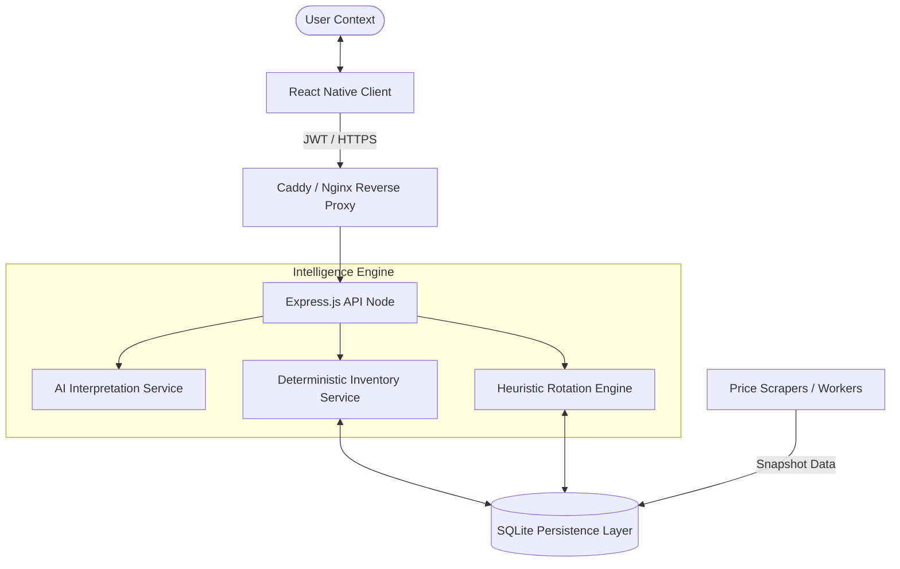

# PantryPilot

A deterministic grocery-first household intelligence platform engineered for automated inventory orchestration and demand-aware meal planning.

---

## Overview

PantryPilot addresses the complexity of modern household supply chain management by providing a centralized, high-precision inventory engine. Unlike conventional list-making applications, PantryPilot implements a deterministic state machine for inventory tracking, paired with a heuristic recommendation engine that factors in consumption fatigue, price optimization, and cross-item dependencies.

The system is designed for high-availability, supporting a dual-active deployment strategy across managed cloud environments (Render.com) and self-hosted Linux partitions (Ubuntu 24.04). It caters to power users who require reliable, low-latency logging in ambient kitchen environments while maintaining a secure, multi-tenant backend.

---

## Key Features

### Inventory Orchestration

- **Deterministic Stock Tracking**: Implementation of integer-math based unit normalization to prevent floating-point drift in large-scale inventory logs.
- **Dynamic Thresholding**: Automated reorder triggers based on historical consumption velocity and user-defined minimums.
- **Expiry Guard**: Priority-based usage suggestions for items nearing physiological or shelf-life limits.

### Heuristic Recommendations

- **Fatigue-Aware Lunch Engine**: A rotation algorithm utilizing a 7-day cooldown period and weighted preference scores to prevent meal boredom.
- **AI interpretation Layer**: Heuristic parsing of natural language inputs into structured transactional logs (supports text and voice-to-text).

### Financial Optimization

- **Supermarket Price Snapshots**: Integration points for live pricing data from New Zealand supermarket chains.
- **Cheapest Basket Resolver**: Backend logic to calculate the most cost-effective sourcing for upcoming meal cycles.

### Operational Resilience

- **Offline Persistence**: A persistent transaction queue (SyncQueue) ensuring 100% data integrity during intermittent connectivity.
- **Dual-Active Deployment**: Parallel support for Docker-based cloud instances and manual VPS partitions with automatic data protection.

---

## System Architecture

PantryPilot is built as a modular monorepo, enforcing strict separation between the interpretation layer and the deterministic state engine.

### Component Topology



### Execution Flow: Inventory Adjustment

1. **Request**: Mobile client captures NL input ("Used 200g of flour").
2. **Interpretation**: `AIService` parses input into a structured transaction log.
3. **Normalization**: `UnitConverter` scales quantity (200g) into the base integer format (200).
4. **Validation**: `InventoryService` checks against `StockEntry` for validity.
5. **Persistence**: Transaction committed to SQLite; `clientId` marked to prevent duplication.

---

## Project Structure

| Directory  | Responsibility         | Key Files / Interactions                                                |
| :--------- | :--------------------- | :---------------------------------------------------------------------- |
| `backend/` | Primary API Gateway    | Express logic, Sequelize models, and core services.                     |
| `mobile/`  | Client Interface       | React Native components, SyncQueue, and Design System.                  |
| `infra/`   | Infrastructure-as-Code | Docker Compose, Nginx configurations, and VPS setup scripts.            |
| `workers/` | Background Tasks       | Price scraping, data normalization, and scheduled maintenance.          |
| `tools/`   | Automation & CI        | Deployment scripts, cryptographic signing tools, and linter extensions. |
| `docs/`    | Governance             | Roadmap, project plans (ATLAS-GATE), and system documentation.          |

---

## Technology Stack

### Backend Logic

- **Node.js & Express**: Chosen for non-blocking I/O efficiency and rapid API iteration.
- **Sequelize ORM**: Provides a robust abstraction over the SQLite persistence layer, ensuring schema consistency across environments.
- **JWT (JSON Web Tokens)**: Decoupled authentication for stateless service scaling.

### Frontend Client

- **React Native (Expo)**: Unified codebase for high-performance Android and iOS delivery.
- **AsyncStorage**: Enables the `SyncQueue` persistence required for offline-first resilience.
- **Lucide Icons**: Standardized geometric iconography for visual clarity.

### Data & Persistence

- **SQLite3**: Lightweight, zero-configuration database, ideal for household-scale multi-tenancy.
- **Playwright (Planned)**: Scheduled for headless price scraping across NZ supermarket environments.

---

## Installation and Setup

### Local Development

1. **Clone the repository**:
   ```bash
   git clone https://github.com/dylanmarriner/PantryPilot
   cd PantryPilot
   ```
2. **Bootstrap dependencies**:
   ```bash
   npm install
   ```
3. **Environment Setup**:
   Create a `.env` in the `backend/` directory:
   ```env
   PORT=3000
   JWT_SECRET=your_secure_secret
   NODE_ENV=development
   ```
4. **Boot Strategy**:
   ```bash
   # Run backend and mobile concurrently
   npm run dev
   ```

### Production Deployment (Docker)

The recommended deployment method for cloud instances (Render.com/DigitalOcean):

```bash
docker-compose -f infra/docker-compose.yml up --build -d
```

---

## API Documentation

### Auth Protocol

- `POST /api/auth/register`: Initialize unique user and household.
- `POST /api/auth/login`: Authenticate and retrieve household context.

### Inventory Interface

- `GET /api/inventory`: Retrieve current household stock levels.
- `POST /api/inventory/adjustment`: Submit an atomic inventory change.
- `GET /api/inventory/search`: Query the global item database with alias support.

---

## Deployment Strategy

PantryPilot employs a **State-Preserving Deployment** model:

1. **Cloud (Render.com)**: Automated builds from the `main` branch. Persistence is maintained via managed volume mounts mapped to the SQLite binary location.
2. **VPS (Manual)**: Controlled via `tools/deploy_vps.sh`. The script executes an atomic code swap while explicitly excluding `.sqlite` and `.env` files to prevent catastrophic state loss.

---

## Development Workflow

### Governance Model (ATLAS-GATE v2)

Every major feature follows a strict 7-section plan structure, cryptographically signed by the executor.

1. **Planning**: Technical requirements defined in `docs/plans/`.
2. **Signing**: Plan hashed and signed using `tools/sign_v2.mjs`.
3. **Execution**: Implementation restricted to the plan's path allowlist.
4. **Verification**: Multi-stage gate validation before merge.

### Scripts and Automation

- `npm run lint`: Enforces code quality across the monorepo.
- `npm run test`: Executes the Jest-based unit and integration suite.
- `./tools/deploy_vps.sh`: Secure production sync for self-hosted instances.

---

## Security Considerations

- **Stateless Auth**: All sessions are managed via JWTs with a 24-hour TTL by default.
- **Input Sanitization**: Every API endpoint uses `express-validator` to prevent injection and malformed payloads.
- **State Isolation**: Production databases are excluded from standard deployment tarballs to prevent accidental overwrites.

---

## Roadmap

The project follows a 10-phase master roadmap.

- **Current Status**: Phase 9 (Product-Ready Expansion) - Completed.
- **Next Milestone**: Phase 10 (Public Beta & Analytics).

Detailed phase definitions are tracked in [docs/roadmap.md](docs/roadmap.md).

---

## License

This project is licensed under the MIT License. See [LICENSE](LICENSE) for details.

---

_Built by the PantryPilot Engineering Team._
