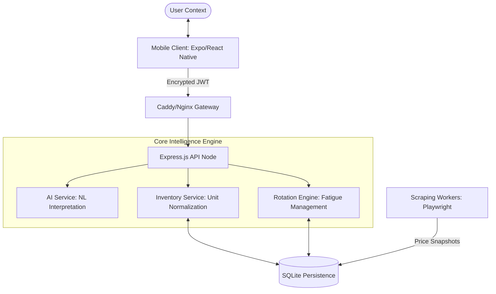

# 🧭 PantryPilot

[](docs/roadmap.md)
[](https://pantrypilot-api.onrender.com/health)
[](http://100.93.214.100:3000/health)
[](LICENSE)
[]()

**PantryPilot** is an advanced, grocery-first household intelligence platform. It moves beyond simple list-making into **deterministic inventory orchestration**, utilizing natural language interpretation and fatigue-aware recommendation engines to automate the domestic supply chain.

---

## 🏗️ System Architecture & Internals

PantryPilot is designed as a modular monorepo with strict decoupling between the interpretation layer and the deterministic engine.

### 🧩 High-Level Component Topology



---

## 🧠 Core Intelligence Modules

### 1. Deterministic Unit Normalization (`UnitConverter`)

Unlike traditional apps that store strings, PantryPilot uses a **Base-Unit Normalization** strategy using **Integer Math** to avoid floating-point drift.

- **Weight Base**: Grams (g)
- **Volume Base**: Milliliters (ml)
- **Count Base**: Absolute units
- **Ambiguity Resolver**: Handles "oz" (ounce) contextually—converts to `weight` (g) or `volume` (ml) based on the target item's metadata.

### 2. Lunch Rotation & Fatigue Engine (`LunchEngine`)

To prevent "lunch boredom," the engine calculates an **Acceptance Score** for every item:
$$Score = (Preference \times 0.4) + (FatiguePenalty \times 0.3) + (StockBonus \times 0.2) + (Freshness \times 0.1)$$

- **Fatigue Management**: Items accumulate "fatigue" points per use, which decay over a 7-day cooldown period.
- **Deterministic Randomness**: Recommendations are sorted using a seeded-random hash to ensure consistent options within a 24-hour window.

### 3. Asynchronous Sync Protocol (`SyncQueue`)

The mobile client implements a robust, idempotent transaction log.

- **State Machine**: `PENDING` → `IN_PROGRESS` → `COMPLETED` | `FAILED`.
- **Conflict Resolution**: Client-side timestamps act as versions; the backend uses a "Last-Writer-Wins" strategy for concurrent household updates.
- **Persistence**: AsyncStorage-backed queue survives app restarts and OS-level process kills.

---

## 🎨 Design System & UI Philosophy

PantryPilot uses a **High-Contrast "Glassmorphism"** design system defined in `DesignSystem.js`.

- **Primary Canvas**: `#050505` (True Black) for OLED efficiency.
- **Accent Palette**:
  - `Cyan-500` (#22d3ee) for interactive actions.
  - `Fuchsia-500` (#d946ef) for AI/Premium features.
- **Visual Tokens**:
  - `Cards`: 40% opacity Zinc-900 with subtle background blur.
  - `Borders`: 10% white for delicate structure without clutter.

---

## 📡 API Reference

### Authentication

| Method | Endpoint             | Description                              |
| :----- | :------------------- | :--------------------------------------- |
| `POST` | `/api/auth/login`    | Returns JWT and Household Context        |
| `POST` | `/api/auth/register` | Initializes new user + default Household |

### Inventory Management

| Method | Endpoint                    | Description                               |
| :----- | :-------------------------- | :---------------------------------------- |
| `GET`  | `/api/inventory`            | List all items with normalized quantities |
| `POST` | `/api/inventory/adjustment` | Atomic quantity update (supports NL)      |
| `GET`  | `/api/inventory/low-stock`  | Retrieve items below reorder threshold    |

### AI & Strategy

| Method | Endpoint             | Description                                              |
| :----- | :------------------- | :------------------------------------------------------- |
| `POST` | `/api/ai/interpret`  | Parse NL (e.g., "Ate 200g of beef") into structured JSON |
| `GET`  | `/api/meals/suggest` | Get top-scored meal recommendations                      |

---

## 📦 Deployment & DevOps

PantryPilot features a **Dual-Active Deployment** strategy.

### Primary: Render.com (Cloud Native)

- **Engine**: Docker (Multi-stage build).
- **Storage**: Persistent Disk (mounted at `/data`).
- **Networking**: Automated TLS via Cloudflare/Render.

### Failover: Self-Hosted VPS (Ubuntu 24.04)

- **Management**: `./tools/deploy_vps.sh`.
- **Strategy**: Excludes `.sqlite` and `.env` to prevent state loss during code updates.
- **Reverse Proxy**: Nginx/Caddy handling port 3000 mapping.

---

## 🛠️ Development Setup

### System Prerequisites

- **Node.js**: v18.17+ (LTS recommended)
- **Native**: Watchman (macOS/Linux), Android Studio (for Emulators)
- **Database**: SQLite3 binary installed

### Installation Flow

1. **Initialize Workspace**:
   ```bash
   npm run bootstrap # Installs all monorepo dependencies
   ```
2. **Setup Environment**:
   ```bash
   cp .env.example .env
   # Populate JWT_SECRET and NODE_ENV
   ```
3. **Database Migration**:
   ```bash
   cd backend && npx sequelize-cli db:migrate
   ```
4. **Boot Development**:
   ```bash
   npm run dev:all # Concurrent boot of Backend + Mobile
   ```

---

## 🧭 Roadmap & Governance

We adhere to the **ATLAS-GATE v2** governance model. Every phase is cryptographically signed and verified before implementation.

- **Current Progress**: [docs/roadmap.md](docs/roadmap.md)
- **Active Plan**: [docs/plans/](docs/plans/)
- **Governance**: [docs/GOVERNANCE.md](docs/GOVERNANCE.md)

---

## 📄 License & Attribution

Licensed under the **MIT License**. Created with ❤️ by the PantryPilot Engineering Team.

---

_PantryPilot - Because your kitchen should be as smart as your code._
