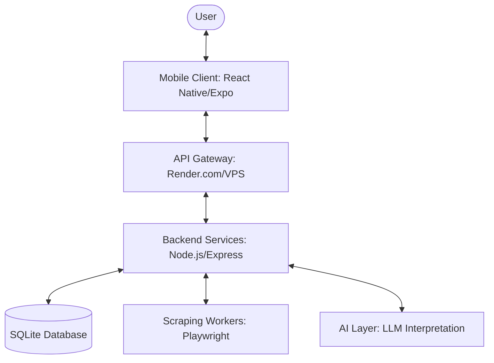

# 🧭 PantryPilot

[](docs/roadmap.md)
[](https://pantrypilot-api.onrender.com/health)
[](LICENSE)

**PantryPilot** is a grocery-first household intelligence platform designed to eliminate food waste and automate meal orchestration. It combines a robust inventory engine with AI-powered interpretation and a premium mobile experience.

---

## 🚀 Key Features

- **Modern Inventory Tracking**: Deterministic stock management with unit normalization (g, kg, ml, L, jars).
- **AI interpretation Layer**: Natural language and voice logging for ultra-fast kitchen interactions.
- **Lunch Variation Engine**: Intelligent rotation to prevent "lunch fatigue" while optimizing for stock levels and price.
- **Pricing Engine**: Live price tracking and budget optimization for New Zealand supermarkets.
- **Hybrid Sync**: Seamless offline/online transition for reliable usage in low-connectivity areas.
- **Secure Deployment**: Automated SSL-enabled hosting on Render.com with a high-performance VPS failover.

---

## 🏗 Architecture

PantryPilot is built as a modular monorepo, ensuring strict separation of concerns and high scalability.



### Components

- **[Backend](backend/README.md)**: Node.js/Express API with SQLite/Sequelize persistence.
- **[Mobile Client](mobile/README.md)**: Premium Android application optimized for readability and speed.
- **Workers**: Automated background tasks for price scraping and data normalization.
- **Governance**: Managed via the [ATLAS-GATE v2](docs/GOVERNANCE.md) system.

---

## 🛠 Tech Stack

| Layer              | Technologies                                             |
| :----------------- | :------------------------------------------------------- |
| **Frontend**       | React Native, Expo, Lucide Icons, Custom Design System   |
| **Backend**        | Node.js, Express, Sequelize, JWT, Docker                 |
| **Infrastructure** | Render.com, Ubuntu 24.04 VPS, Caddy/Nginx                |
| **Database**       | SQLite3 (Persistent via volume mounts/excluded tarballs) |
| **AI**             | OpenAI/Claude for NL Component Interpretation            |

---

## 📦 Deployment & Setup

### Automated Deployment (Render.com)

The project is configured for continuous deployment. Every push to `main` triggers a Docker-based build on Render.

- **Endpoint**: `https://pantrypilot-api.onrender.com`

### Native Development Setup

1. **Clone & Install**:
   ```bash
   git clone https://github.com/dylanmarriner/PantryPilot
   cd PantryPilot
   npm install
   ```
2. **Launch Backend**:
   ```bash
   cd backend && npm run dev
   ```
3. **Launch Mobile**:
   ```bash
   cd mobile && npx expo start
   ```

### VPS Deployment (Manual Fallback)

A secure deployment script is available for manual VPS management:

```bash
./tools/deploy_vps.sh
```

_Note: This script automatically preserves your production database and environment variables._

---

## 🧭 Roadmap & Governance

We follow a strict, phase-gated roadmap. Current status: **Phase 9 (Product Expansion) - Completed**.

Detailed progress and feature breakdowns can be found in:

- [🧭 Master Roadmap](docs/roadmap.md)
- [⚖️ Governance Model](docs/GOVERNANCE.md)
- [📜 Implementation Log](docs/plans/)

---

## 📄 License

This project is licensed under the MIT License - see the [LICENSE](LICENSE) file for details.

---

_Built with ❤️ by the PantryPilot Team_
